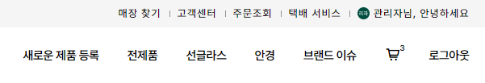
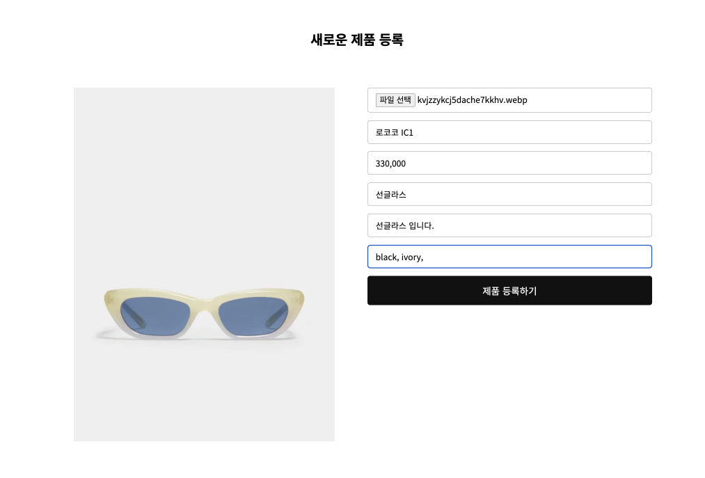
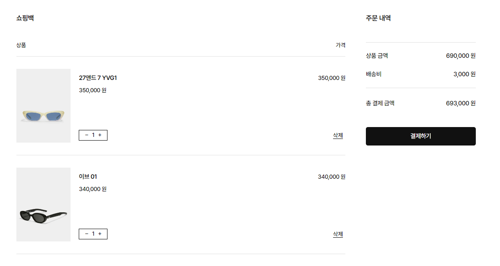

# GENTLE MONSTER


Gentle Monster 공식 사이트를 기반으로 리디자인 · 개발한 프로젝트로, 포트폴리오용으로 제작되었습니다.

## 프로젝트 설명
- **진행 시기**: 2023.01
- **진행 방식**: 개인 프로젝트 (기여도 100%)
- **배포 링크**: https://gentle-monster-project.vercel.app

## 기술 스택
- **Backend / Auth**: Firebase
- **Frontend**: React
- **Data Fetching**: TanStack Query
- **Styling**: Sass
- **Deployment**: Vercel

## 주요 기능

### 1. 로그인 상태 관리



- `firebase`의 `onAuthStateChanged()`를 사용해 사용자의 로그인 상태를 감지하고, 로그인한 사용자가 변경될 경우 `callback` 함수에 `updatedUser` 정보를 전달하여 상태를 관리합니다.
- 기존 로그인 유지 및 사용자 전환 시에도 상태가 실시간 반영됩니다.

    ```jsx
    export function onUserStateChange(callback) {
      onAuthStateChanged(auth, async (user) => {
        const updatedUser = user ? await adminUser(user) : user;
        callback(updatedUser);
      });
    }
    ```

### 2. 제품 등록 (관리자 기능)



- `firebase`의 `uid`로 특정 계정을 관리자(admin)로 지정하고, 해당 계정으로 로그인한 경우에만 **제품 등록 페이지** 접근이 가능하도록 구현했습니다.
- 등록된 제품은 **Firebase Realtime Database**와 **Cloudinary**를 통해 관리할 수 있습니다.
- 👩🏻‍💻 관리자 테스트 계정
    
    ```
    아이디: teest0208@gmail.com
    비밀번호: test1234@@
    ```

### 3. 장바구니 기능



- `firebase`의 `set()` 메서드를 사용해 사용자가 장바구니에 담은 상품을 `carts/{userId}/{productId}` 경로에 실시간으로 저장합니다.
- 동일 상품 추가 시 업데이트되며, 사용자별로 개별 관리됩니다.

    ```jsx
    export async function addOrUpdateToCart(userId, product) {
      return set(ref(database, `carts/${userId}/${product.id}`), product);
    }
    ```

### 4. 제품 상세 페이지

- `react-router`의 동적 라우팅을 사용해 `/detail/:id` 경로로 이동 시 `useLocation()` 훅을 통해 해당 제품 정보를 전달받아 상세 정보를 표시합니다.

